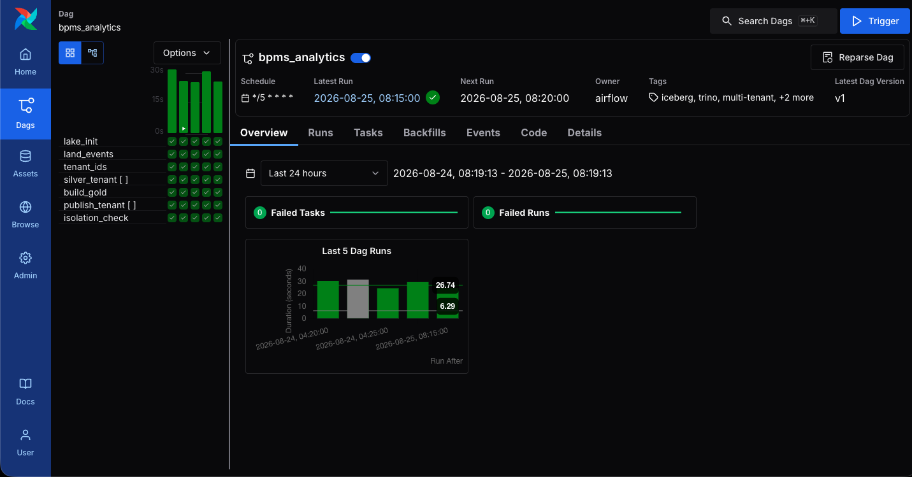
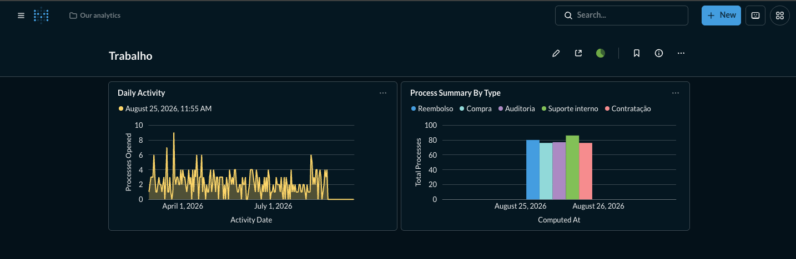
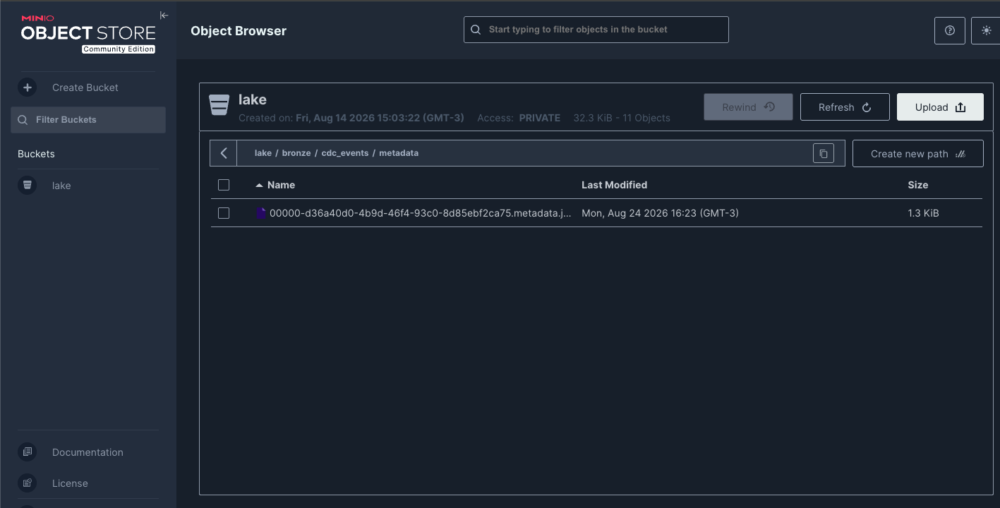
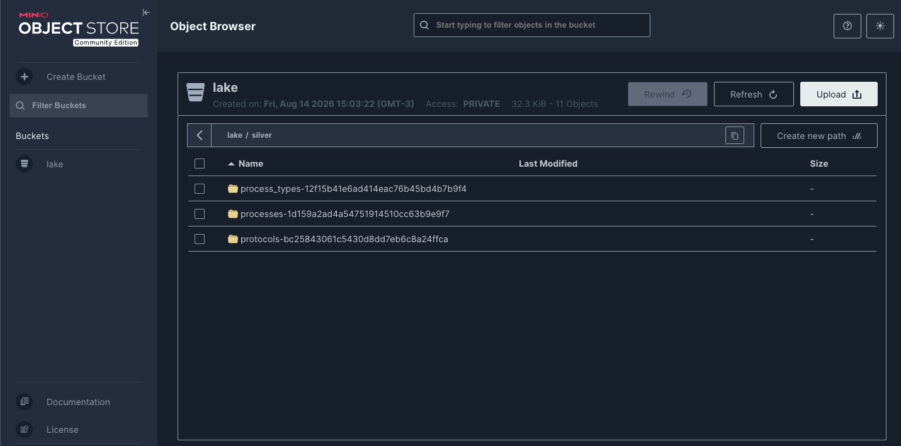
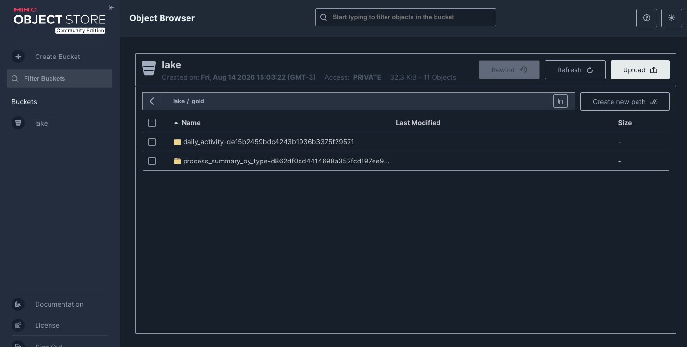
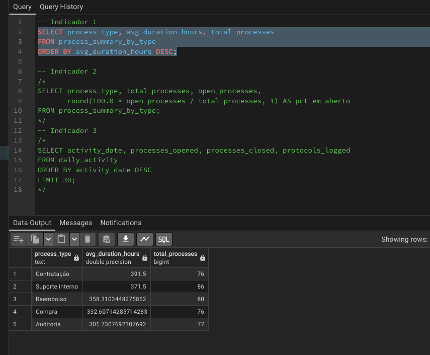
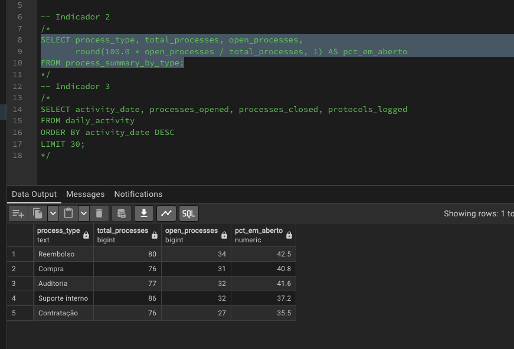
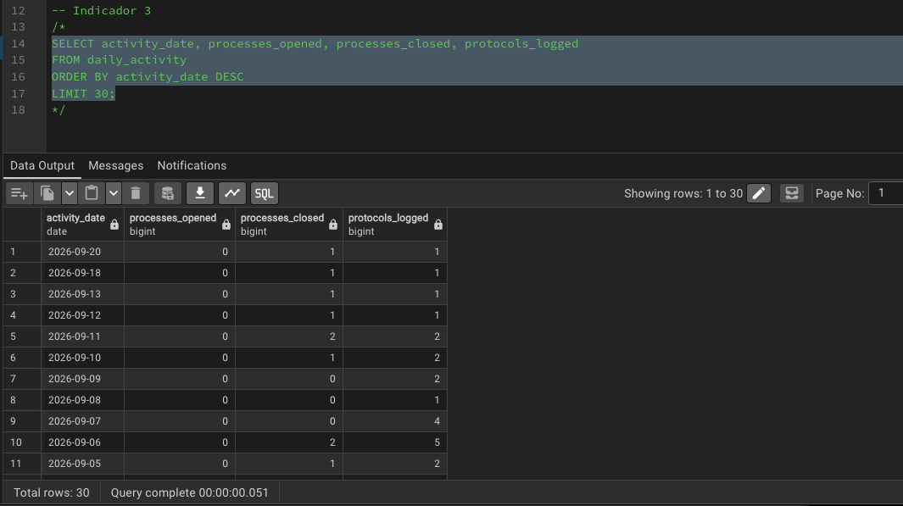
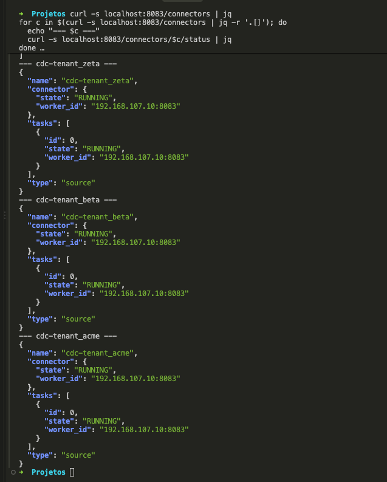

# Pipeline de Big Data - Plataforma analítica multi-tenant (BPMS)

Autores: Yuri e Pedro

## Sobre o projeto

Esse projeto foi construído pra testar uma stack de Big Data na prática, montando um pipeline completo do zero e rodando ele de ponta a ponta em ambiente local.

O tema é um sistema de gestão de processos (BPMS) usado por várias empresas ao mesmo tempo (multi-tenant), onde cada empresa tem o próprio banco de dados isolado, do jeito que costuma acontecer em produtos SaaS de verdade.

O problema que o pipeline resolve: cada empresa (tenant) vai gerando eventos o tempo todo nos processos dela (abertura, movimentação, encerramento). A gente captura essas mudanças quase em tempo real, organiza tudo em camadas dentro de um data lake, calcula alguns indicadores de negócio e entrega o resultado final num banco separado para cada tenant, com um teste automático que roda a cada execução pra garantir que nenhuma empresa consegue ver o dado da outra.

Quem se interessaria por esse dado seria o gestor de cada empresa cliente, que quer acompanhar indicadores dos próprios processos (duração média, volume por dia, quantos foram cancelados) sem risco nenhum de ver dado de outra empresa.

## Arquitetura

O fluxo geral é esse:

```
Bancos de origem (1 por tenant)
        │  captura de mudanças (CDC), 1 conector por tenant
        ▼
Fila de eventos (tópicos por tenant/tabela)
        │  leitura dos eventos
        ▼
Camada Bronze  (dado cru, sem tratamento, guardado como veio)
        │  limpeza e deduplicação, por tenant
        ▼
Camada Silver  (estado atual de cada tabela, já tratado)
        │  agregações
        ▼
Camada Gold    (indicadores prontos pra consulta)
        │  publicação
        ▼
Banco de "serving", um banco separado por tenant, com credencial exclusiva
        │  teste de isolamento a cada execução
        ▼
Dashboard (visualização final)
```

Tudo isso é coordenado por uma orquestração única que garante a ordem: uma etapa só começa depois que a anterior termina.

## Tecnologias usadas

| Camada | Tecnologia | Pra que serve aqui |
| --- | --- | --- |
| Origem | PostgreSQL | um banco por tenant, simula o banco de produção |
| Captura de mudanças (CDC) | Debezium + Kafka Connect | pega insert/update/delete direto do log do banco, um conector por tenant |
| Fila de eventos | Apache Kafka | transporta os eventos entre a origem e o lake |
| Armazenamento | MinIO | armazenamento de objetos compatível com S3, guarda as camadas Bronze/Silver/Gold |
| Formato de tabela | Apache Iceberg | permite atualizar e versionar dados guardados como arquivo |
| Processamento | Trino | roda as transformações e agregações em SQL |
| Orquestração | Apache Airflow | decide a ordem e o paralelismo das etapas, roda a cada 5 minutos |
| Banco final (serving) | PostgreSQL | um banco e um usuário por tenant, camada de consulta |
| Visualização | Metabase | dashboard conectado no banco final |
| Infraestrutura | Docker Compose | sobe todos os serviços localmente |

## Fonte de dados

Os dados são sintéticos: geramos processos e eventos fictícios de um BPMS com um script SQL que usa `random()`, com uma semente diferente pra cada tenant pra não ficar tudo igual.

Formato: começa relacional no banco de origem, vira JSON no transporte, vira Parquet/Iceberg nas camadas do lake, e volta a ser relacional no banco final.

Volume: 3 empresas de exemplo, com 400, 800 e 1200 processos cada, dá pra adicionar mais sem mexer em código. No total, alguns milhares de linhas de eventos já na carga inicial.

Frequência: contínua. Qualquer mudança no banco de origem já gera um evento de captura quase na hora, e o pipeline processa em ciclos de 5 em 5 minutos.

Problemas de qualidade que a gente trata:

- Eventos duplicados (o sistema de fila pode entregar o mesmo evento mais de uma vez): resolvido garantindo que só a versão mais recente de cada registro conta.
- Exclusão lógica (registros marcados como excluídos mas que continuam no banco): filtrados antes de entrar nos indicadores.
- Processos que ainda estão abertos (sem data de encerramento): tratados pra não distorcer a média de duração.

## Como rodar

Pré-requisitos: Docker e Docker Compose, e uns 4 GB de RAM livres.

Subir o ambiente:

```bash
docker compose up -d --build
docker compose ps
```

Leva uns 2 minutos pra tudo ficar de pé (o motor de consulta e o orquestrador demoram mais).

Disparar o pipeline: abre o Airflow, entra na DAG do projeto e clica em Trigger. Acompanha até todas as etapas ficarem verdes. Depois disso ele roda sozinho a cada 5 minutos.



Conectar o dashboard (só precisa fazer isso uma vez): abre o Metabase, cria a conta de admin, e conecta um banco PostgreSQL usando o host, porta, nome do banco, usuário e senha do tenant que quiser visualizar. Depois cria um gráfico pra cada indicador e junta os dois num dashboard.



Comandos úteis:

| Comando | O que faz |
| --- | --- |
| `docker compose up -d --build` | sobe tudo |
| `docker compose ps` | mostra o status de cada serviço |
| `docker compose logs -f airflow` | acompanha os logs do orquestrador |
| `docker compose exec trino trino` | abre o terminal pra rodar consultas |
| `docker compose down` | derruba os containers, mantém os dados |
| `docker compose down -v` | derruba tudo e apaga os dados (reset completo) |

## Estrutura dos dados

| Camada | Onde fica | O que tem |
| --- | --- | --- |
| Bronze | armazenamento de objetos | evento cru, sem tratamento, guardado exatamente como chegou |
| Silver | armazenamento de objetos | dados já limpos e deduplicados, um snapshot do estado atual |
| Gold | armazenamento de objetos | indicadores já calculados e agregados |
| Serving | banco relacional, um por tenant | cópia dos indicadores daquele tenant, sem identificar o tenant na coluna, só ele consegue acessar |





## Consultas e indicadores

Indicador 1, duração média por tipo de processo:

```sql
SELECT process_type, avg_duration_hours, total_processes
FROM gold.process_summary_by_type
WHERE tenant_id = 'tenant_acme'
ORDER BY avg_duration_hours DESC;
```

Indicador 2, percentual de processos ainda em aberto:

```sql
SELECT
    process_type,
    total_processes,
    open_processes,
    round(100.0 * open_processes / total_processes, 1) AS pct_em_aberto
FROM gold.process_summary_by_type
WHERE tenant_id = 'tenant_acme';
```

Indicador 3, volume de atividade por dia:

```sql
SELECT activity_date, processes_opened, processes_closed, protocols_logged
FROM gold.daily_activity
WHERE tenant_id = 'tenant_acme'
ORDER BY activity_date DESC
LIMIT 30;
```

Resumo do que cada indicador mostra:

| Indicador | O que mostra |
| --- | --- |
| Duração média por tipo | tempo médio, em horas, entre abertura e encerramento de cada tipo de processo |
| Percentual em aberto/fechado/cancelado | quantos processos de cada tipo estão em cada situação |
| Atividade diária | quantos processos abriram, fecharam e quantos eventos foram registrados por dia |



As três consultas acima rodando, direto na camada Serving do tenant `tenant_acme` via pgAdmin (mesma tabela da Gold, só sem a coluna `tenant_id` — que nem é publicada nessa camada — e já filtrada pelo isolamento por database):







## Orquestração

A execução segue essa ordem, sem pular etapa:

```
prepara o lake -> captura os eventos -> trata cada tenant -> calcula os indicadores -> publica cada tenant -> testa o isolamento
```

As etapas de tratar e publicar rodam uma vez pra cada tenant, em paralelo, então se um tenant tiver problema nos dados, não trava o processamento dos outros.

Conectores CDC (um por tenant) ativos na API do Kafka Connect, todos em `RUNNING`:



## Limitações conhecidas

- As credenciais estão fixas no ambiente local, o que funciona pra rodar e testar, mas nunca seria feito assim em produção.
- A etapa de recalcular os indicadores apaga e insere de novo, então tem uma janela curta onde a tabela fica vazia durante a atualização.
- Não tem rotina de manutenção automática do armazenamento (compactação de arquivos antigos), precisaria disso num uso mais longo.
- Se mudar algo no banco de origem, tipo adicionar uma coluna nova, é preciso ajustar manualmente a transformação da camada Silver.
- Cada tenant usa um canal próprio de captura no banco de origem, e isso precisa ser monitorado se a quantidade de tenants crescer muito, pra não sobrecarregar o banco.
